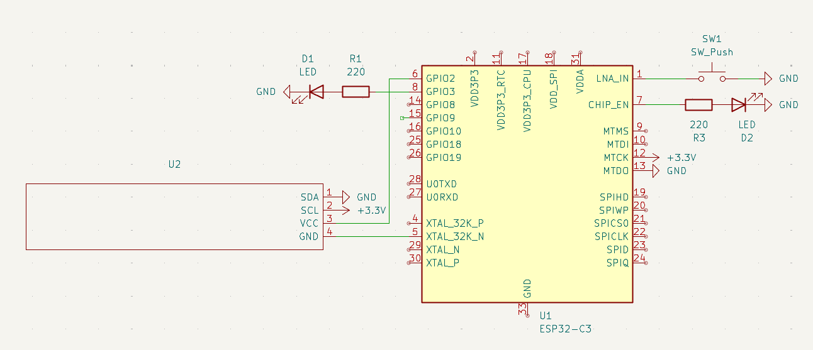
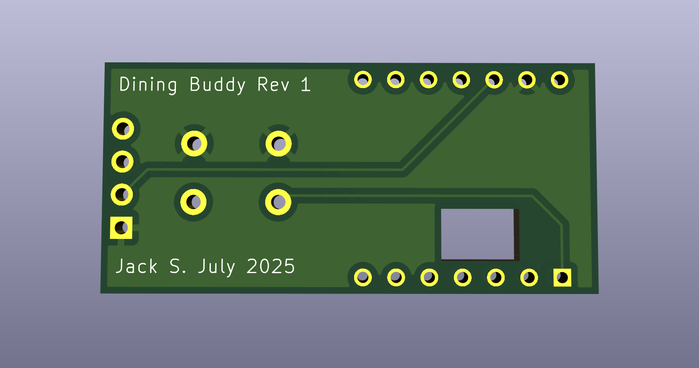
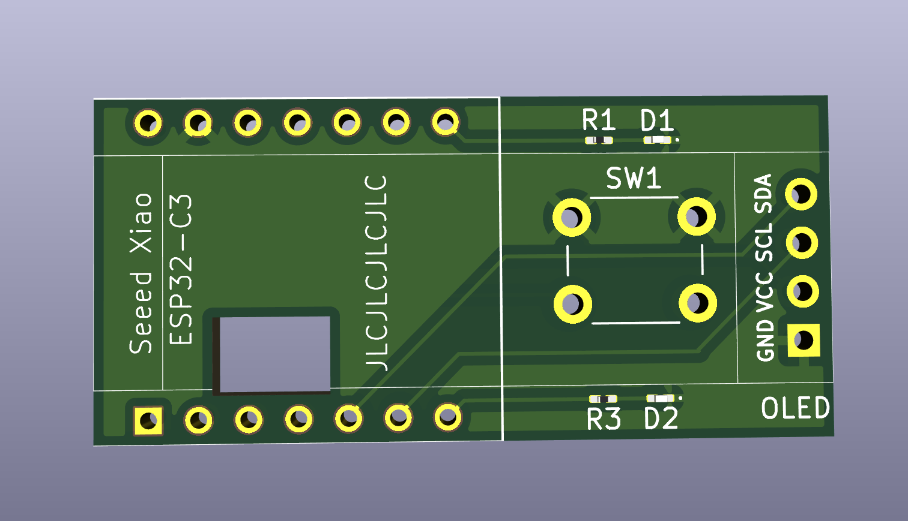

# Dining Buddy v6.0  
**ESP32-C3 OLED Keychain for UCLA Dining Menus + Weather Display**

## Overview

Dining Buddy is an ultra-compact ESP32-C3-based keychain device that displays **UCLA dining hall menus** and **real-time weather**, with full offline functionality, minimal power use, and intuitive controls—all on a tiny OLED screen.

Menus are downloaded once daily and displayed with smooth auto-scrolling. The device also includes a **date selection mode**, **hall switching**, and a **live weather page**. It deep sleeps after 30 seconds of inactivity and wakes automatically every night at 2:30 AM to rotate cached menu files and download new ones.

All interaction is handled with a **single button**, and menu data is stored in **SPIFFS**. The PCB was custom-designed in **KiCad** for a minimal, keychain-friendly form factor.

## Photos
### Prototype

### Finished Solder Assembly

### Schematic

### PCB

## Features

- 📅 View current and future dining menus (up to 6 days)
- 🏛️ Supports Bruin Plate, Epicuria, De Neve, and Rendezvous
- 🌦️ Weather fetch from [wttr.in](https://wttr.in)
- 🕒 Deep sleep with scheduled nightly wake (2:30 AM)
- 📡 Wi-Fi download over UCLA Wi-Fi or eduroam
- 🪛 Single-button interaction (short, long, double press)
- 🔋 OLED shuts off in deep sleep to preserve battery
- 🧾 All menus saved as clean, compact `.menu` files

## 🔧 Bill of Materials

| Component                    | Description                            |
|-----------------------------|----------------------------------------|
| **ESP32-C3**                | Seeed Studio ESP32-C3 dev board        |
| **OLED Display**            | 0.91" I2C SSD1306 (128×32)             |
| **Push Button**             | 6mm tactile push button                |
| **Custom PCB**              | Designed in KiCad for compact layout   |
| **0603 Resistor** (optional)| 220Ω for LED indicator                 |
| **0603 LED** (optional)     | Miscellaneous LED feedback             |

## 🕹 User Guide

**Navigation is controlled by one button:**

| Press Type        | Action                               |
|------------------|----------------------------------------|
| Short Press       | Next menu section                     |
| Long Press        | Switch to next dining hall            |
| Double Press      | Enter/exit date select mode           |
| Long in Date Mode | Show weather                          |
| Short in Date Mode| Scroll day forward                    |
| Double in Date Mode| Confirm date + return to menu        |
| Inactivity (30s)  | Enter deep sleep                      |

**Modes:**

- **Normal Mode:** Default menu viewing mode with auto-scroll
- **Date Select Mode:** Choose a day (up to 5 days ahead)
- **Weather Mode:** Shows date, time, and latest weather

## How Menus Are Managed

- On first boot, menus for the next 5 days are downloaded.
- Every night at 2:30 AM, yesterday’s menus are deleted, future menus are shifted forward, and the new sixth day is fetched.
- Menu data is extracted from HTML pages and saved as readable text.

## Setup Instructions

1. Flash the ESP32-C3 with the `DiningBuddy` sketch using Arduino IDE.
2. Add your local Wi-Fi or eduroam credentials to `LOCAL_SSID`, `LOCAL_PASS`, and `EAP_*` fields.
3. On boot, the device downloads menus and displays the current one.
4. Power off is automatic after inactivity; just press the button to wake.

## Hardware

- **MCU**: ESP32-C3 (Wi-Fi, deep sleep capable)
- **Display**: 128×32 OLED (SSD1306 via I2C)
- **Button**: Wired to GPIO 2 (input with pull-up)
- **LED**: Optional, wired to GPIO 21 via 220Ω resistor
- **Power**: LiPo or USB 5V
- **PCB**: Designed in KiCad for ultra-compact fit on a keychain

## Future Improvements

- Battery charging circuit on PCB  
- Auto time zone detection via Wi-Fi  
- Menu item filtering (vegetarian, vegan, etc.)  
- BLE companion app?

## 👤 Author

**Jack Shi**  
📧 jackmshi@ucla.edu  
🔬 UCLA Electrical Engineering

